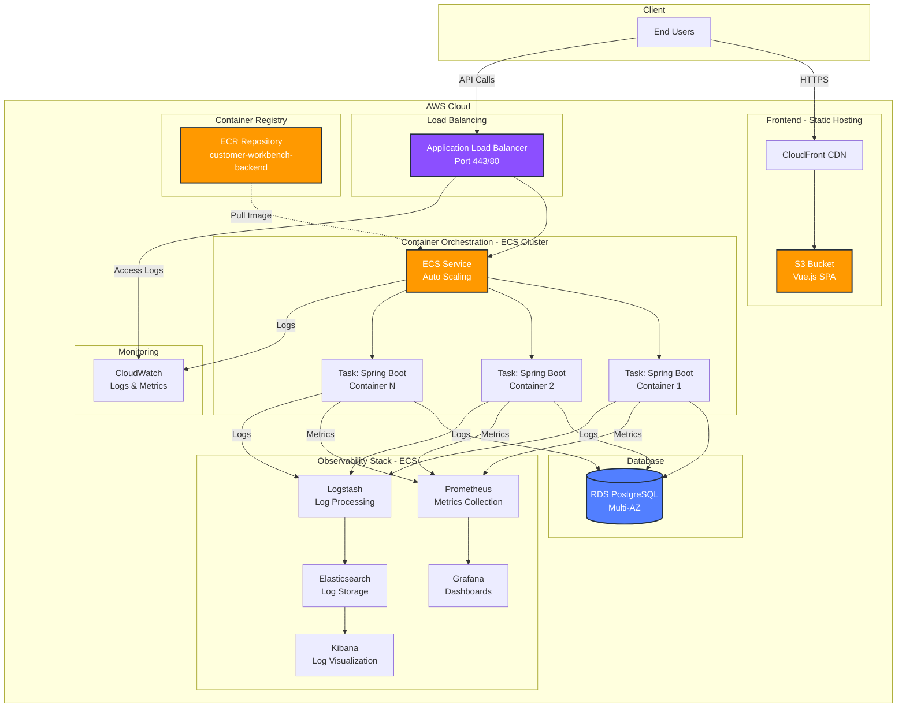

# AWS Deployment Plan

## Architecture Overview

## Deployment Steps

### 1. Containerize Spring Boot Application
- Create Dockerfile with Java 21 base image
- Build JAR with Maven
- Build Docker image

### 2. Push to ECR
- Authenticate Docker with ECR
- Create ECR repository
- Tag and push Docker image

### 3. Setup Backend Infrastructure

**RDS PostgreSQL**
- Automated backups enabled

**ECS Cluster (Fargate)**
- Create ECS cluster
- Define task: Spring Boot container, 2 vCPU, 4GB RAM
- Configure environment variables (DB credentials from Secrets Manager)
- Create ECS service with auto-scaling

**Application Load Balancer**

### 4. Setup Observability Stack

**Prometheus + Grafana (ECS)**
- Deploy Prometheus as ECS service
- Configure to scrape `/actuator/prometheus` from Spring Boot tasks
- Deploy Grafana as ECS service
- Configure dashboards for JVM metrics, request rates, latency

**ELK Stack**
- **Option A**: Use Amazon OpenSearch Service (managed)
- **Option B**: Deploy Elasticsearch, Logstash, Kibana as ECS services
- Configure Spring Boot to log to stdout → CloudWatch → Logstash → Elasticsearch
- Access logs via Kibana dashboards

**CloudWatch**
- Container logs from all ECS tasks
- ALB access logs
- RDS performance metrics
- Create alarms for high CPU, memory, error rates

### 5. Frontend Deployment

**Option A: S3 + CloudFront**
- Build Vue.js application
- Upload to S3 bucket configured for static website hosting
- Create CloudFront distribution with custom domain

**Option B: ECS (For enhanced observability)**
- Containerize Vue.js with nginx
- Deploy to same ECS cluster
- Adds full logging and metrics visibility
- More operational overhead but better monitoring

### 6. CI/CD Pipeline
- Use GitHub Actions or AWS CodePipeline
- Build → Test → Push to ECR → Update ECS service
- Run smoke tests post-deployment