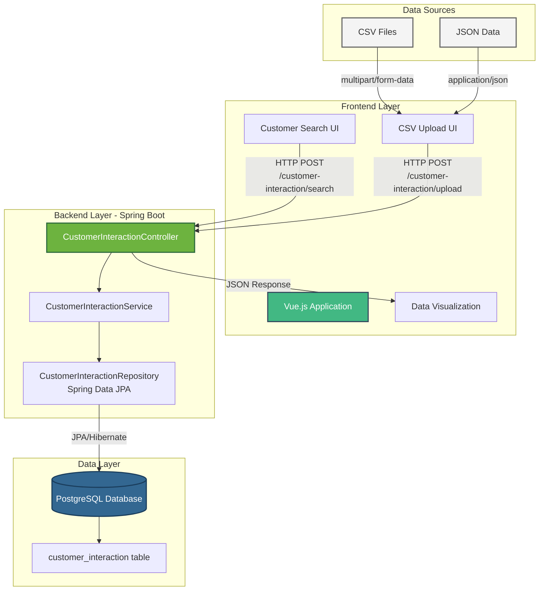

# Customer Workbench Backend - Design Document

## Overview

This document describes the architecture, design decisions, and technical considerations for the Customer Workbench Backend application. The system is designed to manage customer interactions by providing REST API endpoints for uploading interaction data (CSV/JSON) and searching with flexible filtering capabilities.

## System Architecture



## Data Flow

### 1. CSV Upload Flow

```
User selects CSV file in Vue.js UI
    ↓
Vue.js sends HTTP POST to /customer-interaction/upload
    ↓ (multipart/form-data)
CustomerInteractionController receives MultipartFile
    ↓
CustomerInteractionService parses CSV using Jackson CSV
    ↓
Service converts CSV rows to CustomerInteraction entities
    ↓
CustomerInteractionRepository persists entities via JPA
    ↓
Hibernate executes batch INSERT statements
    ↓
PostgreSQL stores data in customer_interaction table
    ↓
Controller returns 201 CREATED to Vue.js
    ↓
UI displays success confirmation to user
```

**Key Points:**
- CSV parsing handles column mapping automatically via Jackson
- Data validation occurs at the entity level using JPA constraints
- Transactions ensure all-or-nothing persistence
- Large files are streamed to avoid memory issues

### 2. Search Flow

```
User enters search criteria in Vue.js UI
    ↓
Vue.js constructs CustomerInteractionRequest JSON
    ↓
HTTP POST to /customer-interaction/search
    ↓ (application/json)
CustomerInteractionController receives request
    ↓
Service layer calls Repository with search parameters
    ↓
Repository builds dynamic JPA query with specifications
    ↓
Hibernate translates to SQL with WHERE clauses
    ↓
PostgreSQL executes query with pagination
    ↓
Results flow back: DB → Repository → Service → Controller
    ↓
Controller converts Page to CustomerInteractionSearchResponse
    ↓
JSON response sent to Vue.js
    ↓
UI renders results in data grid/table
```

**Key Points:**
- Pagination handled at database level for efficiency
- Dynamic query building supports optional filters
- Response DTO separates internal Page structure from API contract
- All timestamps use UTC (Instant type) for consistency and simplicity

### 3. Data Persistence Flow

```
CSV/JSON Data
    ↓
Spring Boot parses and validates
    ↓
Service layer transforms to entities
    ↓
JPA/Hibernate manages entity lifecycle
    ↓
Hibernate generates SQL (INSERT/UPDATE)
    ↓
PostgreSQL executes and commits transaction
    ↓
Database persists to customer_interaction table
```

## Design Decisions and Assumptions

### Data Types

| Field | Type | Rationale |
|-------|------|-----------|
| `id` | Long (BIGINT) | Auto-generated primary key, supports large datasets |
| `productId` | Long (BIGINT) | Assumption: Product catalog can grow to millions of items |
| `customerId` | Long (BIGINT) | Assumption: Customer base can scale to millions of users |
| `customerRating` | Integer | Assumed range 1-10, simple integer sufficient |
| `feedback` | String (VARCHAR 1000) | Assumption: Feedback limited to 1000 characters for this exercise |
| `timestamp` | Instant | UTC timestamps for timezone-agnostic storage |
| `responsesFromCustomerSupport` | String (VARCHAR 1000) | Assumption: Support responses limited to 1000 characters |
| `interactionType` | Enum (CHAT, EMAIL, TICKET) | Fixed set of interaction channels |
| `message` | String (VARCHAR 1000) | Assumption: Messages limited to 1000 characters |

**Assumptions Rationale:**
- **Character limits (1000)**: For this exercise, assumed that customer feedback and messages would be concise. In a production system, these might be TEXT fields with no limit, or use a configurable maximum.
- **No user authentication**: Focused on core functionality; authentication would be added in production.

### File Upload Assumptions

| Aspect | Assumption | Rationale |
|--------|-----------|-----------|
| File Size | < 100 MB | For this exercise, assumed moderate file sizes. Production would need: <br/>- Streaming processing for large files<br/>- Progress indicators<br/>- File size validation |
| File Format | Standard CSV with headers | Assumed well-formed CSV with consistent headers matching entity fields |
| Concurrent Uploads | Single user, low concurrency | Production would need: <br/>- Queue-based processing<br/>- Background jobs<br/>- Upload status tracking |
| Error Handling | Fail-fast on parse errors | Assumed clean data for exercise. Production would need:<br/>- Partial success handling<br/>- Error reporting per row<br/>- Retry mechanisms |

## Testing Strategy

### Integration Tests vs Unit Tests

This project uses **integration tests** exclusively, with no isolated unit tests. Here's why:

#### Why Integration Tests?

1. **CSV Parsing is the Core Logic**
   - The primary business logic is CSV parsing and database persistence
   - An integration test for CSV upload validates:
     - File upload handling (multipart/form-data)
     - CSV parsing (Jackson configuration)
     - Entity mapping
     - Database persistence
     - Transaction management
     - HTTP response handling

2. **Thin Service Layer**
   - Service methods are primarily delegating to repositories
   - Little complex business logic to test in isolation
   - Integration tests provide better coverage of actual behavior

3. **Real Database Interactions Matter**
   - JPA query behavior (pagination, filtering)
   - Transaction boundaries
   - Database constraints and validation
   - Integration tests with H2 validate these better than mocks

4. **HTTP Contract Validation**
   - Integration tests verify the actual REST API contract
   - Request/response serialization
   - HTTP status codes


### Testing Environment

- **H2 In-Memory Database**:
  - PostgreSQL compatibility mode
  - Schema auto-generated from JPA entities (create-drop)
  - Flyway disabled for tests
  - Fast execution, no external dependencies

- **Test Data**:
  - MOCK_DATA.csv (709KB, thousands of records)
  - Realistic data for pagination testing

## Database Schema Design

### Primary Table: customer_interaction

```sql
CREATE TABLE customer_interaction (
    id BIGSERIAL PRIMARY KEY,
    product_id BIGINT NOT NULL,
    customer_id BIGINT NOT NULL,
    customer_rating INTEGER,
    feedback VARCHAR(1000),
    timestamp TIMESTAMP,
    responses_from_customer_support VARCHAR(1000),
    interaction_type VARCHAR(255),
    message VARCHAR(1000)
);
```

**Index** (Future Optimization):
```sql
-- For filtering by customer
CREATE INDEX idx_customer_id ON customer_interaction(customer_id);
```

## Conclusion

This design prioritizes simplicity and correctness for the exercise while documenting assumptions and production considerations. The integration test approach provides comprehensive coverage of the critical path (CSV upload → database → search) while maintaining fast execution and avoiding over-mocking of Spring/JPA components.

The architecture is ready for frontend integration with Vue.js and can be extended with production features (async processing, caching, monitoring) as requirements evolve.