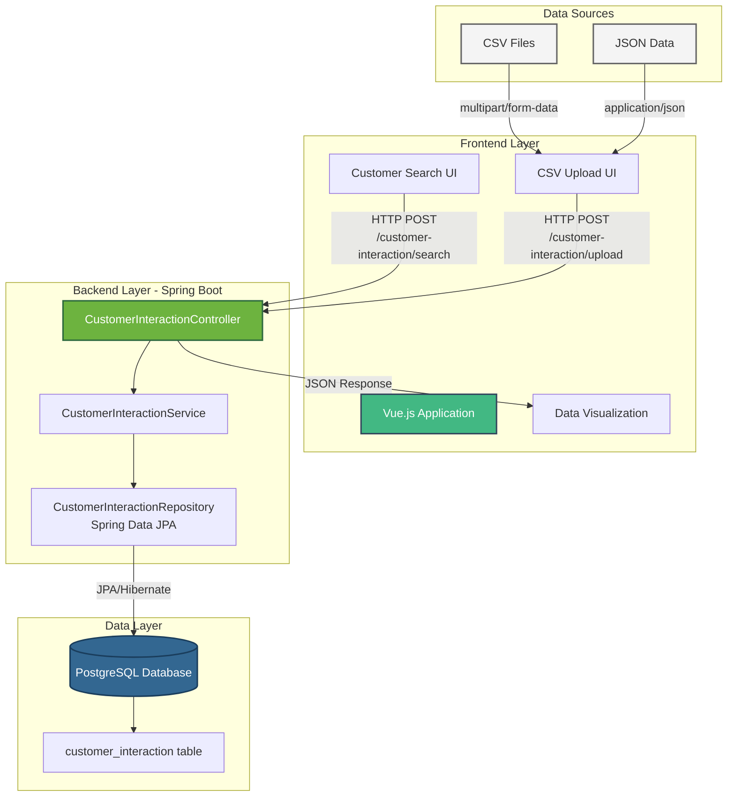

# Customer Workbench Backend

A Spring Boot application for managing customer interactions with support for CSV data upload and search functionality.

## Architecture



### Component Responsibilities

| Component | Technology | Responsibility |
|-----------|-----------|----------------|
| **Vue.js Frontend** | Vue 3, Axios | User interface for searching interactions, uploading CSV files, and visualizing data |
| **Spring Boot API** | Spring Boot 4.0, Spring MVC | REST API endpoints for data operations |
| **Service Layer** | Spring Services | Business logic, CSV parsing, data validation |
| **Repository Layer** | Spring Data JPA, Hibernate | Database abstraction and ORM |
| **PostgreSQL** | PostgreSQL 16 | Persistent data storage |

### API Flow

1. **CSV Upload Flow**:
   ```
   User → Vue.js → POST /customer-interaction/upload → Controller → Service (CSV Parser) → Repository → PostgreSQL
   ```

2. **Search Flow**:
   ```
   User → Vue.js → POST /customer-interaction/search → Controller → Service → Repository → PostgreSQL
   PostgreSQL → Repository → Service → Controller → CustomerInteractionSearchResponse → Vue.js → User
   ```

3. **Data Persistence**:
   ```
   CSV/JSON → Spring Boot → Hibernate → PostgreSQL (customer_interaction table)
   ```

## Prerequisites

- **Java 21** or higher
- **Docker** and Docker Compose
- **Maven** (or use the included Maven wrapper `./mvnw`)

## Quick Start

### 1. Start the PostgreSQL Database

Use Docker Compose to start the PostgreSQL database:

```bash
docker-compose up -d
```

This will start a PostgreSQL 16 container with the following configuration:
- **Database**: `customer_workbench`
- **Username**: `customer_workbench_user`
- **Password**: `customer_workbench_password`
- **Port**: `5432`

Verify the database is running:

```bash
docker-compose ps
```

You should see the `customer_workbench_db` container with status "Up".

### 2. Run Database Migrations

The application uses Flyway for database migrations. Migrations are located in `flyway/sql/`.

If you need to run migrations manually:

```bash
./mvnw flyway:migrate -Dflyway.locations=filesystem:flyway/sql
```

### 3. Run the Application

Start the Spring Boot application:

```bash
./mvnw spring-boot:run
```

The application will start on `http://localhost:8080`.

Alternatively, you can build and run the JAR:

```bash
./mvnw clean package
java -jar target/customer-workbench-backend-0.0.1-SNAPSHOT.jar
```

### 4. Upload Mock Data

Upload the test CSV data using curl:

```bash
curl -X POST \
  http://localhost:8080/customer-interaction/upload \
  -H "Content-Type: multipart/form-data" \
  -F "file=@src/test/resources/MOCK_DATA.csv"
```

You should receive a `201 Created` response.

### 5. Search Customer Interactions

Search for all interactions (paginated):

```bash
curl -X POST \
  http://localhost:8080/customer-interaction/search \
  -H "Content-Type: application/json" \
  -d '{
    "pageNumber": 0,
    "pageSize": 10
  }'
```

Search by customer ID:

```bash
curl -X POST \
  http://localhost:8080/customer-interaction/search \
  -H "Content-Type: application/json" \
  -d '{
    "customerId": 1,
    "pageNumber": 0,
    "pageSize": 10
  }'
```

Search by interaction type:

```bash
curl -X POST \
  http://localhost:8080/customer-interaction/search \
  -H "Content-Type: application/json" \
  -d '{
    "interactionType": "CHAT",
    "pageNumber": 0,
    "pageSize": 10
  }'
```

Search with timestamp range:

```bash
curl -X POST \
  http://localhost:8080/customer-interaction/search \
  -H "Content-Type: application/json" \
  -d '{
    "timestampStart": "2025-01-01T00:00:00Z",
    "timestampEnd": "2025-12-31T23:59:59Z",
    "pageNumber": 0,
    "pageSize": 10
  }'
```

## API Endpoints

### Upload CSV

**POST** `/customer-interaction/upload`

Upload a CSV file containing customer interaction data.

- **Content-Type**: `multipart/form-data`
- **Parameter**: `file` (CSV file)
- **Response**: `201 Created` on success

### Upload JSON

**POST** `/customer-interaction/upload`

Upload customer interactions as JSON.

- **Content-Type**: `application/json`
- **Body**: Array of CustomerInteraction objects
- **Response**: `201 Created` on success

### Search Interactions

**POST** `/customer-interaction/search`

Search customer interactions with filtering and pagination.

- **Content-Type**: `application/json`
- **Request Body**:
  ```json
  {
    "customerId": 1,              // Optional: Filter by customer ID
    "interactionType": "CHAT",    // Optional: CHAT, EMAIL, or TICKET
    "timestampStart": "2025-01-01T00:00:00Z",  // Optional: Start timestamp
    "timestampEnd": "2025-12-31T23:59:59Z",    // Optional: End timestamp
    "pageNumber": 0,              // Required: Page number (0-indexed)
    "pageSize": 10                // Required: Items per page
  }
  ```
- **Response**: JSON object with `content` (array of interactions) and `totalElements`

## Running Tests

The project uses H2 in-memory database for tests. Run all tests with:

```bash
./mvnw test
```

Run specific test:

```bash
./mvnw test -Dtest=CustomerInteractionTest
```

## Database Schema

### CustomerInteraction Table

| Column | Type | Description |
|--------|------|-------------|
| id | BIGINT | Primary key (auto-generated) |
| product_id | BIGINT | Product identifier |
| customer_id | BIGINT | Customer identifier |
| customer_rating | INTEGER | Customer rating (1-10) |
| feedback | VARCHAR(1000) | Customer feedback text |
| timestamp | TIMESTAMP | Interaction timestamp |
| responses_from_customer_support | VARCHAR(1000) | Support responses |
| interaction_type | VARCHAR | Type: CHAT, EMAIL, or TICKET |
| message | VARCHAR(1000) | Interaction message |

## Stopping the Database

To stop the PostgreSQL database:

```bash
docker-compose down
```

To stop and remove all data:

```bash
docker-compose down -v
```

## Troubleshooting

### Database Connection Issues

If the application can't connect to the database, verify:

1. The database container is running: `docker-compose ps`
2. The database is healthy: `docker-compose logs postgres`
3. Connection parameters in `src/main/resources/application.properties` match docker-compose.yml

### Port Already in Use

If port 5432 or 8080 is already in use:

- For PostgreSQL: Edit `docker-compose.yml` and change the port mapping (e.g., `"5433:5432"`)
- For the application: Run with `./mvnw spring-boot:run -Dspring-boot.run.arguments=--server.port=8081`

### CSV Upload Fails

Ensure:
- The CSV file exists at the specified path
- The CSV has the correct format (headers: product_id, customer_id, customer_rating, feedback, timestamp, responses_from_customer_support, interaction_type, message)
- The timestamp format is ISO-8601 (e.g., `2025-10-13T11:50:50Z`)

## Technology Stack

- **Java 21**
- **Spring Boot 4.0.0**
- **Spring Data JPA** with Hibernate
- **PostgreSQL 16** (production)
- **H2 Database** (testing)
- **Flyway** (database migrations)
- **Jackson CSV** (CSV parsing)
- **Lombok** (boilerplate reduction)
- **Maven** (build tool)
